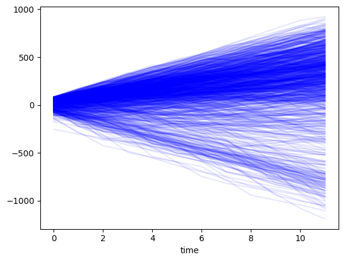

```python
import pandas as pd
import numpy as np
import matplotlib.pyplot as plt
%matplotlib inline

from budget_simulation_tool import ConstantItem, DiscreteItem, ContinuousItem, Budget
```

# Create our items

Each item represents a cashflow, which can be an income or expense.

## Types of cashflows
There are three types of cashflows:
- `ConstantItem`: A constant cashflow:
    - This is a cashflow that is not expected to vary by time.
    - For example, perhaps your gym membership or your internet bill is a fixed amount per month and this is not expected to change.
- `DiscreteItem`: A cash flow that can take a finte amount of scenarios:
    - This is a cash flow that may vary from time to time, but can only take a finite number of possible values.
    - For example, income from employment may have 3 states: `current job, promotion, and unemployed`
- `ContinuousItem`: A cash flow that can take any number of scenarios:
    - This is a cash flow that can take virtually any value.
    - For example, your grocery bill is a continuous variable.
<br><br>

    | NOTE: As we will see, there is nothing stopping us from using `ContinuousItem` for discrete items. The callable is arbitrary so one can certainly use, for example, `np.random.poisson` as the value generating function.|
    | --- |

## Markov Chains
`budget_simulation_tool` also allows next states to depend on the prior state, like a markov chain.

In budgeting, a cashflow's value can often depend on its prior state. For example, if you currently have a job, you are likely to have a job next month. Similarly, perhaps your electricity bill will be autocorrelated because of electricity costs, temperature, etc.

To incorporate this in your budget simulation, you can either use a markov chain for `DiscreteItem`s, or a callable that takes a prior value as an input for `ContinuousItem`s. Examples are provided below


Enough said. Let's look at an example:

# Example

## Establishing the cash flow items


```python
# Constant Item
gym_membership = ConstantItem(
    'gym_membership',
    -5
)

# Discrete Item, does not depend on prior
car_maintenance = DiscreteItem(
    'car_maintenance',
    {'small_item': -5, 'big_item': -30, 'both': -35, 'no_maintenance': 0},
    [0.1, 0.05, 0.01, 0.84]
)
    

# Discrete Item, depends on prior
employment_income = DiscreteItem(
    'employment_income',
    {'cushy_job': 100, 'startup': 80, 'IPO': 1000, 'jobless': 0},
    [
        [0.95, 0.0, 0.0, 0.05],
        [0.1, 0.8, 0.05, 0.05],
        [0.0, 0.0, 0.80, 0.20],
        [0.70, 0.0, 0.0, 0.30]
        ],
    init = 'startup'
    )

# Continuous Item, does not depend on prior
groceries = ContinuousItem(
    'groceries',
    lambda: -np.random.exponential(20),
    )

# Continuous Item, depends on prior
utilities = ContinuousItem(
    'utilities',
    lambda prior: min(-np.random.normal(abs(prior)), 0),
    init = -10
    )
```

## Creating and simulating our budget


```python
fig, ax = plt.subplots()

cumulative_in_a_year = None

for simulations in range(1000):
    budget = Budget(
        gym_membership,
        car_maintenance,
        employment_income,
        groceries,
        utilities
    )

    budget_states, budget_values = budget.simulate(n=12)
    # get the cumulative value after a year
    cum_budet_values = budget_values.cumsum(axis = 0)
    cum_budet_values.sum(axis = 1).plot(ax = ax, alpha = 0.1, c = 'b')
    
    if cumulative_in_a_year is None:
        cumulative_in_a_year = cum_budet_values.iloc[[-1]]
    else:
        cumulative_in_a_year = pd.concat([cumulative_in_a_year, cum_budet_values.iloc[[-1]]], axis = 0)

# sum across all cash flow items
cumulative_in_a_year['total'] = cumulative_in_a_year.sum(axis = 1)
# rename index
cumulative_in_a_year.index.name = 'simulation'
cumulative_in_a_year.index = range(len(cumulative_in_a_year))

cumulative_in_a_year.describe()
```


<div>
<style scoped>
    .dataframe tbody tr th:only-of-type {
        vertical-align: middle;
    }

    .dataframe tbody tr th {
        vertical-align: top;
    }

    .dataframe thead th {
        text-align: right;
    }
</style>

<table border="1" class="dataframe">
  <thead>
    <tr style="text-align: right;">
      <th></th>
      <th>gym_membership</th>
      <th>car_maintenance</th>
      <th>employment_income</th>
      <th>groceries</th>
      <th>utilities</th>
      <th>total</th>
    </tr>
  </thead>
  <tbody>
    <tr>
      <th>count</th>
      <td>1000.0</td>
      <td>1000.000000</td>
      <td>1000.000000</td>
      <td>1000.000000</td>
      <td>1000.000000</td>
      <td>1000.000000</td>
    </tr>
    <tr>
      <th>mean</th>
      <td>-60.0</td>
      <td>-27.620000</td>
      <td>1118.840000</td>
      <td>-237.536001</td>
      <td>-565.419690</td>
      <td>228.264309</td>
    </tr>
    <tr>
      <th>std</th>
      <td>0.0</td>
      <td>25.530127</td>
      <td>111.853322</td>
      <td>63.890828</td>
      <td>398.983339</td>
      <td>419.882203</td>
    </tr>
    <tr>
      <th>min</th>
      <td>-60.0</td>
      <td>-150.000000</td>
      <td>500.000000</td>
      <td>-516.346458</td>
      <td>-1799.161595</td>
      <td>-1189.456123</td>
    </tr>
    <tr>
      <th>25%</th>
      <td>-60.0</td>
      <td>-40.000000</td>
      <td>1100.000000</td>
      <td>-279.841652</td>
      <td>-664.345553</td>
      <td>98.967127</td>
    </tr>
    <tr>
      <th>50%</th>
      <td>-60.0</td>
      <td>-30.000000</td>
      <td>1200.000000</td>
      <td>-229.282236</td>
      <td>-460.778802</td>
      <td>324.202710</td>
    </tr>
    <tr>
      <th>75%</th>
      <td>-60.0</td>
      <td>-5.000000</td>
      <td>1200.000000</td>
      <td>-190.626789</td>
      <td>-331.487816</td>
      <td>503.829536</td>
    </tr>
    <tr>
      <th>max</th>
      <td>-60.0</td>
      <td>0.000000</td>
      <td>1200.000000</td>
      <td>-69.264774</td>
      <td>-12.834609</td>
      <td>921.866088</td>
    </tr>
  </tbody>
</table>
</div>


    

    

